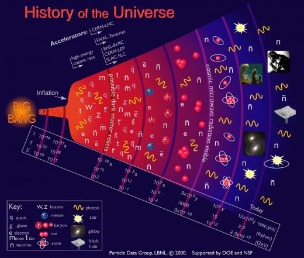

*Réponse publiée [sur Quora](https://fr.quora.com/Quand-l-%C3%A9lectron-est-il-apparu-dans-l-univers/answer/Dr-Goulu)*

pour autant qu'on sache il y en a "toujours" eu, du moins après la supposée inflation.

Mais il se sont devenus abondants pendant l'[Ère leptonique](w:) qui s'étend entre 1 et 10 secondes après le BB.

