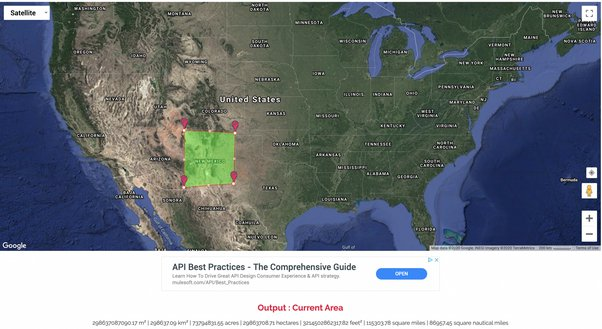
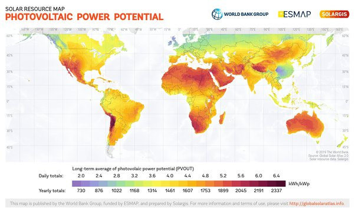

*Réponse publiée [sur Quora](https://fr.quora.com/COP-26-Linstallation-de-trois-millions-d%C3%A9oliennes-et-de-panneaux-solaires-sur-un-petit-pourcentage-des-d%C3%A9serts-de-la-plan%C3%A8te-suffirait-%C3%A0-fournir-suffisamment-d%C3%A9lectricit%C3%A9-pour-le-monde/answer/Dr-Goulu)*

J'ai pas vérifié le calcul, mais ça ne me parait pas trop faux au pif : ce carré dans le désert américain du Nouveau Mexique fournirait toute l'énergie au monde entier (pas seulement l'électricité : toute l'énergie primaire) :

source : [Powering The Entire World With Solar: Surface Area and Panel Requirements - Axion Power](https://www.axionpower.com/knowledge/power-world-with-solar/)

C'est grand, optimiste, il faut des solutions de transport et de stockage, mais c'est pas la surface "désertique" qui manque, y compris à proximité de zones densément peuplées. Le Moyen-Orient fournit du pétrole quasi au monde entier, il pourrait très bien fournir de l'hydrogène ou de l'aluminium ([le carburant du futur…](w:Batterie_aluminium-air))

Si vous regardez la carte des rendements du solaire, vous voyez que les meilleurs endroits ne sont pas ceux proches de l'équateur, mais plutôt les plus secs…

