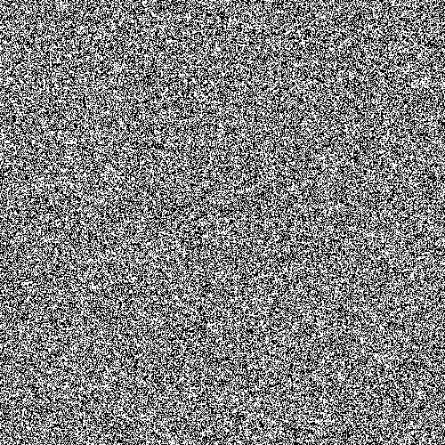

*Réponse publiée [sur Quora](https://fr.quora.com/%C3%80-quelle-%C3%A9poque-lunivers-a-t-il-pu-%C3%AAtre-homog%C3%A8ne-puisque-la-photo-de-WMAP-indique-quapr%C3%A8s-380000-ann%C3%A9es-dexistence-il-ne-l%C3%A9tait-pas/answer/Dr-Goulu)*

Quelle variation de température ou de densité tolerez vous dans un corps "homogène"?

0.0… %? Alors l Univers n'a jamais été homogène. Parce qu un plasma, ou un gaz "homogène" est constitué de particules qui se promènent au hasard.

Et le hasard, ça ne génère pas de structure "homogène".

Voici un gris à 50% d'entropie maximale:

Si vous faites un zoom sur des régions de, disons 10x10 pixels, vous ne trouverez pas partout 50 pixels noirs et 50 blancs. Même à l'œil on voit des zones plus claires et d'autres plus foncées.

Ca serait intéressant de calculer les anisotropies de ce gris pour les comparer à celles du CMB.

Et aussi de simuler l'effet de la gravitation sur ces particules pendant 380'000 ans, avec la bonne échelle.

C'est d'ailleurs exactement ce que font ceux qui simulent le BB sur des super ordinateurs.
