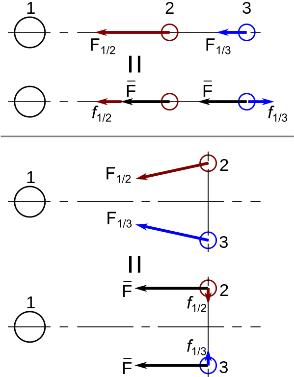
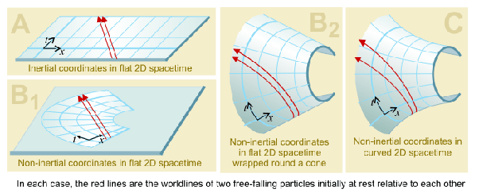

*Réponse publiée [sur Quora](https://fr.quora.com/Est-ce-que-le-dessin-dans-le-commentaire-conjoint-explique-bien-leffet-de-mar%C3%A9e/answer/Dr-Goulu)*

Non rien à voir. Avec un peu d'imagination votre dessin représente des [puits gravitationnels](w:Puits_gravitationnel), mais xkcd en a fait un beaucoup plus joli.

[https://xkcd.com/681_large/](https://xkcd.com/681_large/)

Un bon dessin, conforme à l'explication déjà donnée dans une autre réponse à une autre de vos questions sur le sujet, est celui figurant dans

[https://fr.wikipedia.org/wiki/Fo...](w:Force_de_marée)

Je découvre à l'instant une version relativiste due à un certain Dr. Greg ici[[1]](#hryVH)

Notes de bas de page

[[1]](#cite-hryVH)[http://Post in thread 'How does ...](http://Post in thread 'How does matter accelerate in a gravitational field' https://www.physicsforums.com/threads/how-does-matter-accelerate-in-a-gravitational-field.673304/post-4281670)
