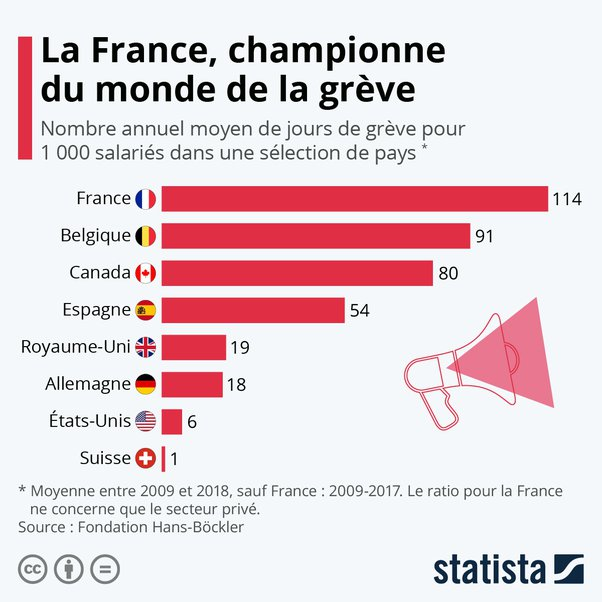

*Réponse publiée [sur Quora](https://fr.quora.com/Pourquoi-la-France-est-elle-consid%C3%A9r%C3%A9e-la-championne-du-monde-de-la-gr%C3%A8ve/answer/Dr-Goulu)*

[Infographie: Dans quels pays fait-on le plus la grève ?](https://fr.statista.com/infographie/4953/nombre-de-jours-de-travail-perdus-pour-fait-de-greve-pour-1000-salaries-par-pays/)
