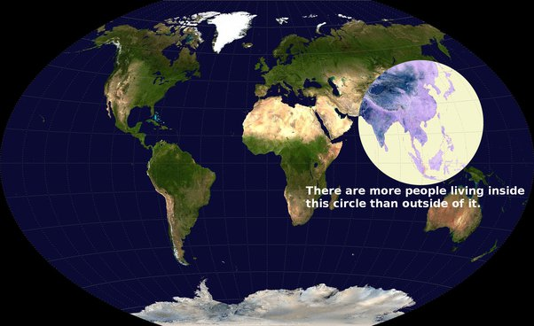

*Réponse publiée [sur Quora](https://fr.quora.com/Hypoth%C3%A9tiquement-parlant-Si-un-ast%C3%A9ro%C3%AFde-d-une-taille-suffisante-pour-cr%C3%A9er-d-%C3%A9normes-d%C3%A9g%C3%A2t-sans-pour-autant-cr%C3%A9er-une-extinction-de-masse-percutait-la-terre-quel-serait-le-pire/answer/Dr-Goulu)*

Là où vivent un maximum d'humains, au centre de ce cercle.

