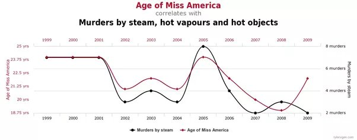

*Réponse publiée [sur Quora](https://fr.quora.com/Quelles-sont-les-corr%C3%A9lations-%C3%A9tablies-entre-des-chiffres-ou-des-donn%C3%A9es-statistiques-a-priori-sens%C3%A9es-mais-en-r%C3%A9alit%C3%A9-inappropri%C3%A9es-infond%C3%A9es-fallacieuses/answer/Dr-Goulu)*

Il y en a de très nombreuses comme

Ici

[https://www.tylervigen.com/spuri...](https://www.tylervigen.com/spurious-correlations)

Et dans le livre "spurious correlations" qui va avec.

En fait c'est plus facile de trouver des corrélations idiotes que sensées dans une masse de données.
