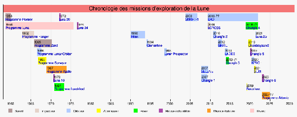

*Réponse publiée [sur Quora](https://fr.quora.com/Pourquoi-n-y-at-il-eu-aucune-mission-humaine-sur-la-Lune-apr%C3%A8s-la-mission-Apollo-11-de-Neil-Armstrong-en-1969/answer/Dr-Goulu)*

Il y a eu

- [Luna 24](w:)en 1976
- (beaucoup de sondes et d'impacteurs, mais pas vraiment d'alunissages, c'est vrai)
- [*Chang'e 3*](w:Chang'e_3)en 2013
- [*Chang'e 4*](w:Chang'e_4) en 2019

( source : [Exploration de la Lune — Wikipédia](w:Exploration_de_la_Lune) )

Pourquoi des robots plutôt que des humains ? parce que c'est beaucoup moins cher, et un peu moins dommage quand ça rate. Ca travaille moins vite, mais plus longtemps.
