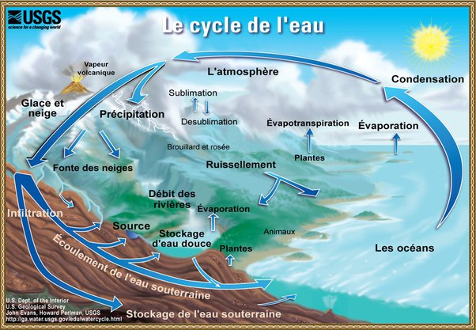

*Réponse publiée [sur Quora](https://fr.quora.com/Comment-l-utilisation-irresponsable-de-l-eau-la-retire-t-elle-du-cycle-de-l-eau/answer/Dr-Goulu)*

Franchement, pour retirer de l'eau du [Cycle de l'eau](w:), il faut vraiment chercher tant il est général :

La seule chose que j'arrive à imaginer seraient les fuites d'hydrogène après électrolyse de l'eau…
