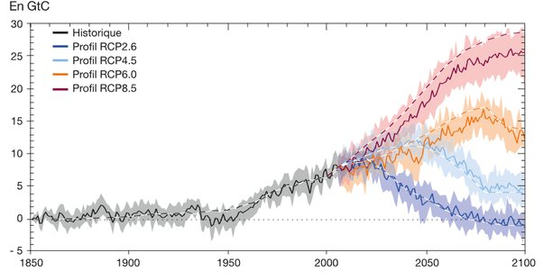
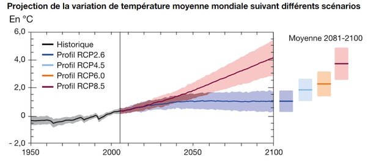

*Réponse publiée [sur Quora](https://fr.quora.com/Peut-on-vraiment-encore-freiner-le-r%C3%A9chauffement-climatique-en-modifiant-notre-comportement/answer/Dr-Goulu)*

Bien sur. Chaque tonne, chaque kilo, chaque gramme de gaz à effet de serre que vous n'émettez pas freine le réchauffement climatique. Un tout petit peu.

Le problème n'est pas vraiment de le freiner mais de le stopper à une valeur supportable. En gros le GIEC a étudié 4 scénarios d'émissions futures :

qui conduisent à 4 estimations de l'élévation de la température à la fin du siècle. Dans les cas "bleus" la température sera stabilisée en 2100, et dans les cas orange et rouge elle continuera à augmenter au 22ème siècle

sources et précisions : [Scénarios et projections climatiques | Chiffres clés du climat](https://www.statistiques.developpement-durable.gouv.fr/edition-numerique/chiffres-cles-du-climat/3-scenarios-et-projections-climatiques)

Personnellement je pense qu'en Europe on sera "bleu ciel" (max d'émissions en 2050) et que le reste du monde sera orange. Si on s'en sort avec +3°C en 2100, ça sera "bien" …
