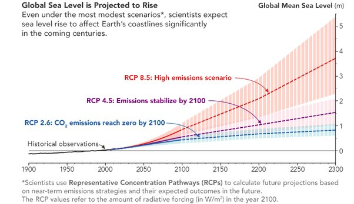

*Réponse publiée [sur Quora](https://fr.quora.com/A-quoi-ressemblera-la-carte-de-la-France-apr%C3%A8s-la-mont%C3%A9e-des-eaux-due-%C3%A0-2C-de-rechauffement-climatique/answer/Dr-Goulu)*

"Après" , c'est dans très longtemps.

Parce que même si nous arrêtions immédiatement toute émission de gaz à effet de serre, l'environnement mettra plusieurs siècles à absorber l'excédent de CO2 que nous avons émis. Et pendant ces plusieurs siècles, nous aurons toujours un forçage radiatif par rapport à la situation de 1850, qui continuera à chauffer la surface des océans, qui vont continuer à chauffer se dilatent, très lentement mais surement. idem pour la fonte de glaciers qui s'y ajoute.

( source [Anticipating Future Sea Levels - Earth Observatory, NASA)](https://earthobservatory.nasa.gov/images/148494/anticipating-future-sea-levels)

Même dans le cas le plus optimiste (RCP 2.6) d'une limitation du réchauffement à 1.5 degrés, le niveau des océans ne sera pas encore stabilisé en 2300.

Je n'ai pas trouvé d'estimation à plus long terme, mais dans le cas RCP 4.5 qui me semble le plus probable, ça devrait pifométriquement se stabiliser vers 2600 à +2m environ.
