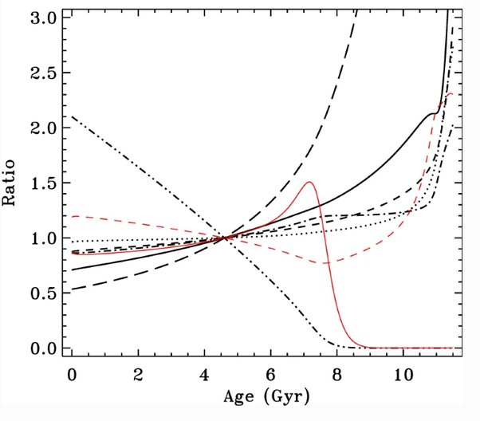

*Réponse publiée [sur Quora](https://fr.quora.com/Pourquoi-l-%C3%A2ge-du-Soleil-est-il-estim%C3%A9-%C3%A0-partir-de-la-fusion-de-10-de-son-hydrog%C3%A8ne/answer/Dr-Goulu)*

A ma connaissance l'âge du Soleil est déduit de celui du système solaire à partir de la [Datation radiométrique](w:) à [l'uranium-plomb](w:Datation_par_l'uranium-plomb) de météorites et de très vieilles roches terrestres.

Je ne crois pas qu'on sache mesurer la composition initiale du Soleil, qui est aujourd'hui de 73,46 % d'hydrogène et de 24,85 % d'hélium (en masse) autrement qu'en "remontant le temps" à partir de la situation actuelle. Peut-être bien qu'on trouve qu'il y avait 10% d'hélium il y a 4.57 milliards d'années…

Oui, ça doit être ça : dans [1] je trouve la figure suivante qui montre en pointillés _.._ le taux d'hydrogène, qui descend régulièrement depuis 2.1 fois sa valeur actuelle jusqu'à zéro à 8 milliards d'années, donc au début il y avait 2.1 fois moins d'hélium que maintenant, soit 24.85% / 2.1 = 11.8% à peu près.

C'est d'ailleurs juste un peu plus que les 9% d'Helium que l' on retrouve dans le milieu interstellaire et qui proviennent de la [Nucléosynthèse primordiale](w:), ce qui est cohérent avec notre modèle du Big Bang.

Tout se tient :-)

Référence

1. Christensen-Dalsgaard, J. (2021). [Solar structure and evolution](https://doi.org/10.1007/S41116-020-00028-3). *Living Reviews in Solar Physics 2021 18:1*, *18*(1), 1–189.
