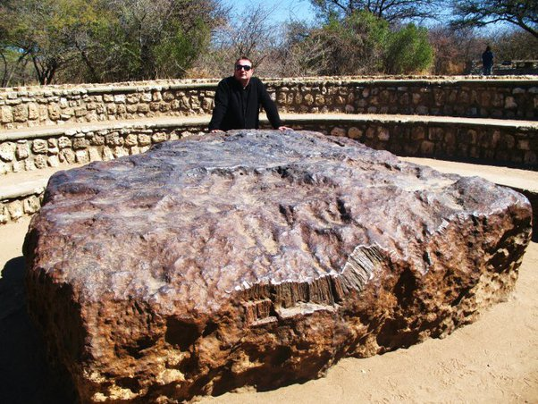

*Réponse publiée [sur Quora](https://fr.quora.com/Avons-nous-la-technologie-pour-exploiter-d-autres-plan%C3%A8tes-Comment-allons-nous-r%C3%A9cup%C3%A9rer-les-m%C3%A9taux/answer/Dr-Goulu)*

Les métaux sur les autres planètes ne sont pas intéressants. Ils sont oxydés, dispersés parce qu'il n'y a pas de tectonique des plaques et de cycle de l'eau pour les concentrer, et ça coûte une blinde en carburant pour les sortir du puits gravitationnel de la planète pour les ramener.

Non, si vous voulez des métaux, il vaut bien mieux exploiter des astéroïdes. Il y en a de fer et de nickel quasi pur, pas oxydé, en blocs de plusieurs tonnes comme la [Météorite d'Hoba](w:)qui est tombée toute seule sur Terre il y a longtemps

( source : [Namibie - Pourquoi Comment Combien](/2010/08/27/namibie/) )

Il y a plusieurs sociétés d'[Exploitation minière des astéroïdes](w:)qui sont déjà sur le coup.

Mais il existe aussi des ressources beaucoup, BEAUCOUP plus précieuses que les métaux.

Par exemple l'[Hélium 3](w:), très rare sur Terre il y en a 100'000 tonnes sur la Lune. Quand on arrivera à faire de la [Fusion aneutronique](w:), chaque tonne d'Helium 3 produira autant d'énergie que 10 milliards de dollars de pétrole ! (et zero déchets à part de l'Helium-4 pour gonfler les ballons. Et de l'hydrogène.
