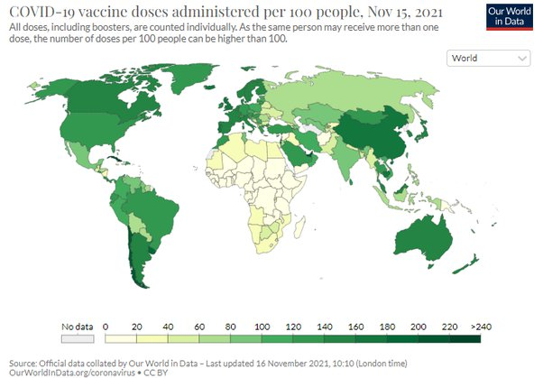

*Réponse publiée [sur Quora](https://fr.quora.com/Comment-faire-confiance-au-vaccin-quand-on-voit-combien-dargent-ils-en-tirent-et-combien-de-pays-pauvres-sont-ignor%C3%A9s/answer/Dr-Goulu)*

Les vaccins coûtent beaucoup moins cher que de soigner les malades. Un jour de soins intensifs (3000 Euro) coûte autant que 100 double doses de vaccins à ARNm (30 Euro). Donc "ils" auraient intérêt à vendre de l'oxygène, des anesthésiques et des médicaments plutôt que des vaccins.

Il y a actuellement [13 vaccins contre la Covid-19 autorisés](w:Liste_de_vaccins_contre_la_Covid-19_autorisés)dans l'un ou l'autre pays, donc certains bien moins chers, moins délicats à transporter (les vaccins à ARNm doivent être conservés très froid). L'Astra-Zeneca ne coute que 6 Euro pour 2 doses et je n'ai pas trouvé les prix des vaccins chinois ou indiens, mais ça doit être en dessous de ça.

Les pays pauvres ne sont pas ignorés, mais ils passent hélas après les pays producteurs. Encore que, en regardant la carte on voit que le Chili et Cuba et sont mieux vaccinés que la France par exemple. L'argent ne fait pas tout, il y a aussi des gouvernements plus efficaces que d'autres.

