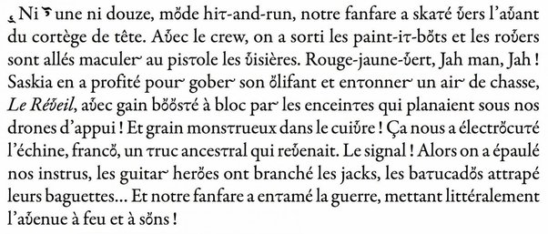

*Réponse publiée [sur Quora](https://fr.quora.com/Lorsque-vous-prot%C3%A9gez-votre-livre-le-copyright-envoyez-vous-la-m%C3%AAme-copie-recto-avec-marges-et-double-interligne-que-vous-allez-envoyer-aux-%C3%A9diteurs/answer/Dr-Goulu)*

ça n'a pas d'importance. Vous protégez votre texte, pas la mise en page.

Encore que pour certains bouquins la présentation ait une importance certaine.

( [Les Furtifs d' Alain Damasio](https://actualitte.com/article/13801/chroniques/les-furtifs-alain-damasio-ou-l-avenir-a-la-lumiere-du-present) … un manuscrit à l'ère d'Unicode, wow !)
