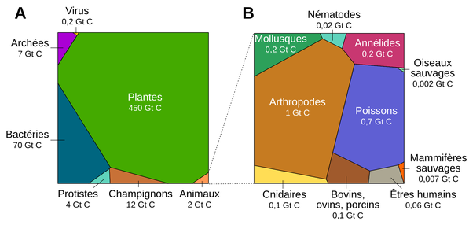

*Réponse publiée [sur Quora](https://fr.quora.com/Pourquoi-l-%C3%A9volution-conduit-elle-toujours-%C3%A0-des-esp%C3%A8ces-plus-avanc%C3%A9es/answer/Dr-Goulu)*

Elle ne fait pas ça du tout. Et d'ailleurs qu'entendez-vous par "avancées" ?

Les bactéries de votre intestin, le platane devant chez vous et le pigeon sur le pavé sont tout aussi évolués que vous, sinon ils auraient disparu.

Toutes les espèces vivant actuellement ont le [même ancêtre commun : LUCA](w:Dernier_ancêtre_commun_universel) et leurs ancêtres ont réussi à s'adapter à tous les changements depuis 3.8 milliards d'années environ, et ils ont été nombreux. Ils sont tous aussi évolués que vous, parce qu'il n'y a pas une, mais des millions de manières de survivre.

Si vous pensez qu'être intelligent est un avantage décisif, qu'il vous confère un statut particulier, regardez ça :

C'est [la répartition de la biomasse sur Terre](https://planet-vie.ens.fr/thematiques/ecologie/relations-trophiques/la-repartition-de-la-biomasse-sur-terre). Le carré de droite agrandit le contenu du petit triangle en bas du carré de gauche.

Nous autres précieux Homo Sapiens intelligents et "avancés" représentons 0.06 Gigatonnes de carbone sur 550 Gigatonnes de matière vivante. Ca fait 1% de 1%. Rien du tout.

Si c'était une tendance de l'évolution, il y aurait plein de chimpanzés, de dauphins et de pieuvres. Ils ne représentent qu'une toute petite partie des mammifères sauvages, qui ne totalisent qu' 1/10ème de notre masse à nous.

D'ailleurs vous les voyez, les anciens maîtres du monde ? Les dinosaures ? Ce sont les oiseaux sauvages, encore 3x moins que les mammifères sauvages.

L'évolution n'a pas de plan, pas de direction. Elle essaie tout au hasard, et ce qui marche survit. Et des espèces très simples, élémentaires, stupides, aveugles, sourdes et muettes vivent très bien depuis des milliards d'années.
