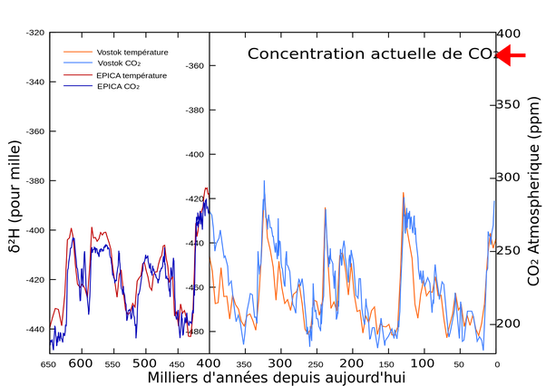

*Réponse publiée [sur Quora](https://fr.quora.com/Comment-avons-nous-des-donn%C3%A9es-de-temp%C3%A9rature-aussi-pr%C3%A9cises-il-y-a-des-milliers-d-ann%C3%A9es/answer/Dr-Goulu)*

Grâce aux "thermomètres isotopiques".

Le plus utilisé actuellement est celui à [Oxygène 18](w:), un isotope stable de l'Oxygène dont l'isotope le plus fréquent est l'Oxygène 16.

Le rapport entre les deux que l'on trouve dans l'oxygène composant l'eau (H2O) est noté [δ18O](w:) et dépend de la température car les molécules d'eau contenant de l'Oxygène 16 sont plus légères et s'évaporent donc plus facilement que celles contenant de l'Oxygène 18 quand il fait froid. Quand il fait chaud, cet effet est moins marqué.

Ensuite cette eau retombe sous forme de neige dans les glaciers, et forme des couches de glace superposées. En forant des carottes de glace, on peut assez facilement compter les couches donc les dater comme pour les cernes d'un arbre, et mesurer le [δ18O](w:)dans chacune pour avoir une estimation de la température de surface des océans à ce moment là.

[https://www.youtube.com/watch?v=...](https://www.youtube.com/watch?v=9lTuoKXkC18)

la même approche fonctionne aussi avec le deuterium, isotope de l'hydrogène présent dans l'eau lourde :

[https://www.cea.fr/multimedia/Pa...](https://www.cea.fr/multimedia/Pages/videos/culture-scientifique/climat-environnement/webdoc-climat/thermometre-isotopique.aspx)

Dans ce cas, le rapport est noté δ2H.

Et dans les bulles d'air emprisonnées, on peut mesurer la concentration de CO2 et retracer ainsi les variations de température et de CO2 sur presque 800'000 ans

(mesures paléoclimatiques tirées du [forage Vostok](w:Base_antarctique_Vostok))
