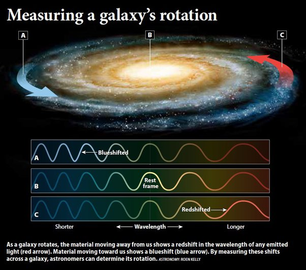

*Réponse publiée [sur Quora](https://fr.quora.com/Les-galaxies-semblent-stationnaires-alors-pourquoi-les-scientifiques-disent-ils-quelles-tournent/answer/Dr-Goulu)*

Le Soleil semble tourner autour de la Terre, pourtant c'est le contraire.

La Terre semble plate, et pourtant elle ne l'est pas.

Les scientifiques ne disent pas ce qui leur semble, parce qu'ils ont appris à se méfier des apparences. Ils disent ce qu'ils mesurent.

Quand on observe une galaxie avec un spectromètre, on s'aperçoit que sa lumière est plus décalée d'un côté que de l'autre, et on peut ainsi mesurer sa vitesse de rotation par effet Doppler :

Avec la sensibilité des instruments actuels, on peut même mesurer la [Courbe de rotation des galaxies](w:)qui donne leur vitesse de rotation en fonction de la distance au centre.

Et là on constate des anomalies, mais c'est une autre histoire.

Si vous voulez poser une bonne question, demandez comment on a mesuré l'[Année galactique](w:)pour le Soleil. J'ai pas trouvé la réponse…
