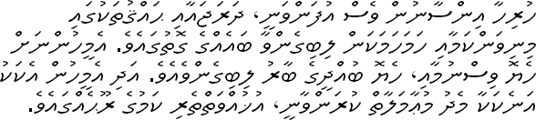

*Réponse publiée [sur Quora](https://fr.quora.com/Des-langages-humains-lequel-vous-parait-il-donner-lieu-%C3%A0-un-d%C3%A9cryptage/answer/Dr-Goulu)*

[https://www.youtube.com/watch?v=...](https://www.youtube.com/watch?v=U0TdkKlsKuw)

Si vous savez l'allemand et en regardant les images vous arriverez à capter quelques mots.

Il y a quelques années, les militaires suisses racontaient qu'à une soirée où étaient présents des russes, l'un d'eux s'est approché d'un groupe d'officiers suisses qui discutaient, et au bout d'un moment il a craqué en leur disant "excusez-moi, je connais environ 50 langues mais là je n'arrive même pas à reconnaître la votre… quelle langue parlez-vous svp ?"

On lui a répondu "Oberwallisertütch"… (dialecte du Haut Valais. Les puristes vous diront qu'il y a de grosses différences selon les vallées latérales, mais bon…)

Sinon je suis assez fier d'avoir compris le principe de l'écriture maldivienne en attendant un avion:

indice : comptez le nombre de symboles différents sur les lignes impaires et sur les lignes paires.
