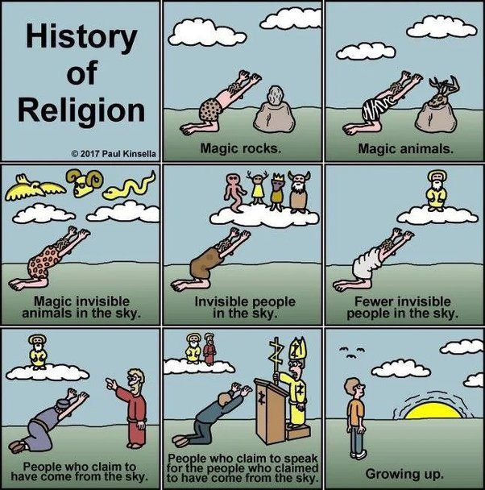

*Réponse publiée [sur Quora](https://fr.quora.com/Comment-pouvons-nous-expliquer-lexistence-de-Dieu-aux-gens-qui-le-connaissent-pas-encore/answer/Dr-Goulu)*

Quel Dieu ? il y en a 3000 dans les religions du monde, et je pense même qu'il y en a autant que de croyants, car je n'en ai jamais rencontré 2 qui aient strictement la même définition.

Un curé pour lequel j'ai un profond respect m'a dit une fois en souriant "Dieu, c'est le mystère." Aujourd'hui je crois comprendre ce qu'il voulait dire : quand on ne comprend pas quelque chose, c'est Dieu.

Donc votre problème, c'est de faire comprendre votre solution à vos mystères à des gens pour lesquels il n'y a plus de mystères, ou beaucoup moins.

