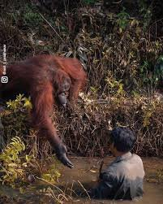

*Réponse publiée [sur Quora](https://fr.quora.com/Quel-animal-sauve-un-autre-animal-d-une-autre-esp%C3%A8ce-lorsque-celui-ci-est-en-danger-except%C3%A9-l-homme/answer/Dr-Goulu)*

Nos cousins les orang-outans. L'Homo Sapiens est dans une rivière infestée de serpents.

