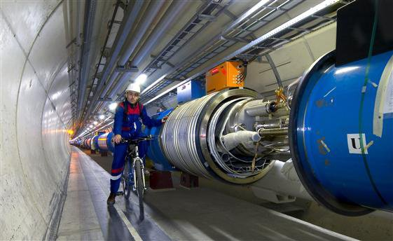
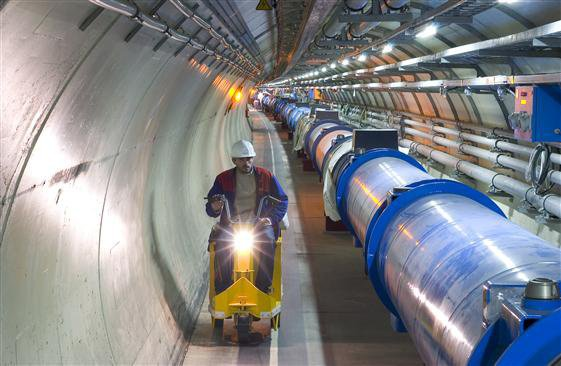

*Réponse publiée [sur Quora](https://fr.quora.com/Qu-est-ce-qui-pourrait-arriver-si-on-faisait-du-v%C3%A9lo-dans-le-Grand-collisionneur-d-hadrons-du-Conseil-europ%C3%A9en-pour-la-recherche-nucl%C3%A9aire/answer/Dr-Goulu)*

on peut se fatiguer, le tunnel fait 27 km de circonférence, avec seulement 4 accès, un tous les 6.75 km :

Mieux vaut utiliser un scooter électrique, c'est prévu pour.

Si c'est la radioactivité qui vous inquiète, voici ce qu'on trouve dans [[1]](#sXdGh)

> 6.3.3 Activité induite le long de l'anneau du LHC
>
>
>
> En moyenne, sur une année, la perte de protons autour de la machine sera de 3.4 x 10^15 protons par faisceau (Cf. tableau 1.2). Dans ce cas, la radioactivité induite totale dans les aimants le long de l'anneau du LHC sera 120 GBq de 3H et 520 GBq d'autres radionucléides dit type émetteur bêta/gamma [Ste92c]. Des faibles débits de dose, de l'ordre de 1 uSv/h, sont estimés tout au long de l'anneau du LHC; localement, dans des endroits où des pertes de faisceau ponctuelles ont eu lieu, on pourra trouver des valeurs plus élevées

Ce n'est pas beaucoup, mais on interdit tout de même toute présence humaine dans le tunnel pendant le fonctionnement de l'accélérateur, au cas où …

Notes de bas de page

[[1]](#cite-sXdGh)[https://www.osti.gov/etdeweb/ser...](https://www.osti.gov/etdeweb/servlets/purl/20058939)
