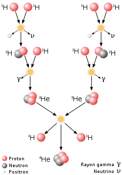
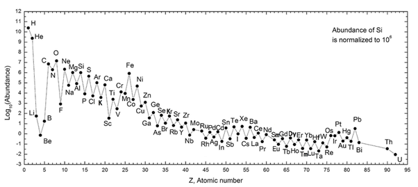

*Réponse publiée [sur Quora](https://fr.quora.com/Comment-se-forment-dans-les-%C3%A9toiles-les-atomes-de-num%C3%A9ro-atomiques-impairs/answer/Dr-Goulu)*

les chaînes de fusion dans les étoiles sont "itératives" : ça ajoute des protons un à un, qui décroissent en neutrons quand le noyau est instable.

La [Chaîne proton-proton](w:)principale dans le Soleil marche comme ça:

On voit qu'elle produit de l' Helium-4 , mais aussi de l'Helium-3. Quand les deux fusionnent, ils produisent du Lithium-7 … (numéro atomique 3, impair)

Dans les étoiles, plus massives, la fusion se fait par [Cycle carbone-azote-oxygène](w:), qui produit des teratonnes d'Azote (numéro atomique 7, impair), puis la [Fusion du carbone](w:)produit le sodium (élément 11), la [Fusion de l'oxygène](w:)produit le phosphore (élément 15) etc, voir [Nucléosynthèse stellaire](w:).

Mais effectivement, comme on le voit le graphique de l'[Abondance des éléments chimiques](w:), les éléments de numéro impair sont un peu moins abondants que leurs voisins "pairs", à l'exception notable du Béryllium (4) qui n'est pas produit dans les étoiles, comme le Bore (5) et le Fluor (9)

