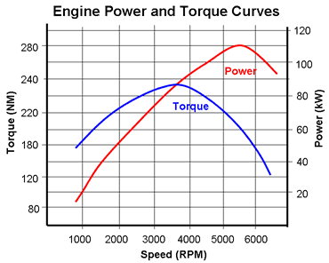

*Réponse publiée [sur Quora](https://fr.quora.com/Les-voitures-%C3%A9lectriques-sont-elles-aussi-puissantes-qu-elles-le-semblent/answer/Dr-Goulu)*

En fait elles ne semblent pas puissantes. Une petite Datsun électrifiée laisse sur place une Maserati ou un Nissan GT-R. Elle a même un limiteur de couple pour ne pas se retourner en wheeling.

[https://www.youtube.com/watch?v=...](https://www.youtube.com/watch?v=RESC54vHr40)

Le truc c'est qu'un moteur électrique a un max de couple à faible vitesse (jusqu'à 60 km/h pour la Tesla S), puis une puissance max "plate" (jusque vers 120 km/h pour la Tesla S)

Alors qu'une voiture à moteur thermique a un couple max et une puissance max à un régime moteur précis, ce qui impose une boite à vitesse, des pertes de temps et de puissance etc.

