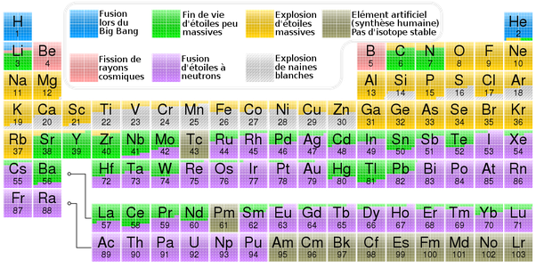

*Réponse publiée [sur Quora](https://fr.quora.com/Est-ce-que-les-atomes-lourd-qui-me-composent-sont-les-m%C3%AAmes-qui-%C3%A9tait-dans-la-supernova-qui-a-surement-cr%C3%A9es-notre-syst%C3%A8me-solaire-Do%C3%B9-le-terme-poussi%C3%A8re-d%C3%A9toile-Etant-donn%C3%A9-que-rien/answer/Dr-Goulu)*

"rien ne se perd, rien ne se crée, tout se transforme" est l'énoncé du principe de Lavoisier, valable en chimie mais qui date d'avant la découverte de la fusion nucléaire dans les étoiles (voir

[https://fr.wikipedia.org/wiki/Nu...](w:Nucléosynthèse_stellaire)

)

Il s'avère que l'hydrogène "crée" des éléments plus lourds, en effet.

sur

[https://fr.wikipedia.org/wiki/Nu...](w:Nucléosynthèse)

Il y a un joli "tableau de Mendeleiev" qui montre l'origine des différents éléments:

L'expression "poussière d'étoile" est due à Hubert Reeves (je crois), qui en a fait le titre d'un de ses excellents livres, mais c'est trop poétique pour être vrai.

"Glaires radioactives expectorées par des étoiles" me semble plus correct…
