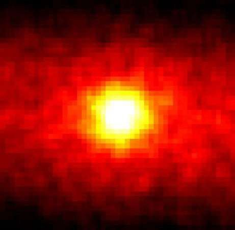

*Réponse publiée [sur Quora](https://fr.quora.com/Peut-on-voir-les-%C3%A9toiles-%C3%A0-travers-la-lune/answer/Dr-Goulu)*

Patience.

Ceci est une "image" du Soleil prise à travers la Terre par le détecteur de neutrinos

[https://fr.wikipedia.org/wiki/Su...](w:Super-Kamiokande)

[https://www.futura-sciences.com/...](https://www.futura-sciences.com/sciences/photos/astronomie-notre-soleil-522/astronomie-soleil-neutrinos-78/)

Un jour on aura des détecteurs de neutrinos assez sensibles pour détecter les étoiles à travers la lune, certainement.
