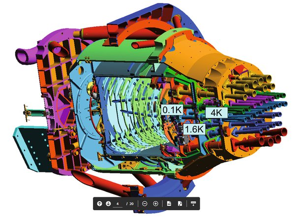

*Réponse publiée [sur Quora](https://fr.quora.com/Pouvez-vous-m-expliquer-comment-le-satellite-Planck-a-fait-pour-imager-le-fond-diffus-cosmologique/answer/Dr-Goulu)*

Pour compléter un peu la [réponse de Dany Fleck](https://fr.quora.com/Pouvez-vous-m-expliquer-comment-le-satellite-Planck-a-fait-pour-imager-le-fond-diffus-cosmologique/answer/Dany-Fleck) + Wikipédia, [l'instrument HFI](w:Planck_(télescope_spatial)) est une véritable merveille d'ingéniosité et de technologie due à [Jean-Michel Lamarre](w:)et son équipe.

Vous trouverez beaucoup d'informations sur HFI dans cet article :

Lamarre, J. M & al.. (2010). [Planck pre-launch status: The HFI instrument, from specification to actual performance](http://www.aanda.org/articles/aa/pdf/2010/12/aa12975-09.pdf). *Astronomy & Astrophysics*, *520*(1), A9. [D](https://doi.org/10.1051/0004-6361/200912975)OI>[10.1051/0004-6361/200912975](https://doi.org/10.1051/0004-6361/200912975)

Notamment cette figure qui montre l'arrangement "en poupées russes" des cornes amenant le rayonnement de bandes de fréquences différentes vers les 54 [Bolomètres.](w:Bolomètre)

La "caméra" de Planck n'a donc que 54 "pixels", et pas tous dans la même "couleur"… Pour obtenir les images que nous connaissons, mais surtout les données sous-jacentes qui intéressent bien plus les astrophysiciens, Planck a du balayer tout le ciel en environ 21 mois.

J'ajoute ma jolie petite anecdote perso sur la cryogénie (et comment on refroidit à 0.1 K) pour ceux qui ne la connaissent pas encore :

[https://www.drgoulu.com/2007/05/...](/2007/05/09/plus-froid-que-lespace-2/)
