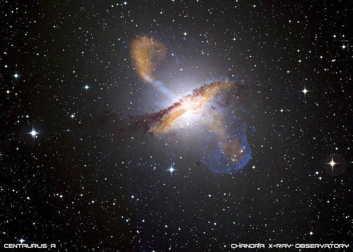

*Réponse publiée [sur Quora](https://fr.quora.com/%C3%89tant-donn%C3%A9-que-presque-chaque-grande-galaxie-a-un-trou-noir-supermassif-en-son-centre-avec-une-masse-de-l-ordre-de-millions-%C3%A0-des-milliards-de-fois-la-masse-du-Soleil-serions-nous-l%C3%A0/answer/Dr-Goulu)*

Bonne question.

En termes de gravitation, le trou noir central d'une galaxie est quasi négligeable. Un [Bulbe galactique](w:)typique a une masse 1000x supérieure à celle du TN supermassif en son centre.

Par contre les trous noirs éjectent une bonne partie de la matière qui tombe sur eux sous forme de [Jets](w:Jet_(astrophysique)) dans les 2 directions de leurs pôles, et ces jets causent une onde de choc dans le milieu intergalactique et la matière "retombe" en pluie vers la galaxie sous l'effet de la gravitation :

on pense que les [Bulles de Fermi](w:)récemment découvertes de chaque côté de la Voie Lactée sont produites ainsi.

Bref, les trous noirs recyclent au moins autant de matière qu'ils n'en avalent. Ce n'est a priori pas assez pour former une galaxie autour d'eux, mais on a pas encore tout compris à propos de ces jets …

[https://www.drgoulu.com/2009/02/...](/2009/02/04/recyclage-galactique/)
