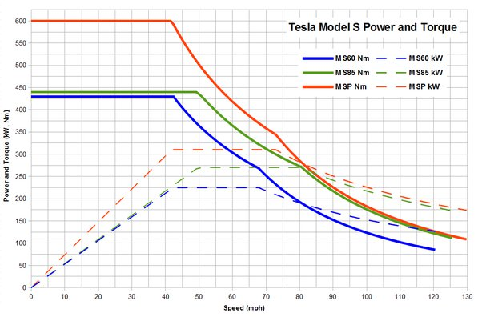

*Réponse publiée [sur Quora](https://fr.quora.com/Est-ce-que-les-voitures-%C3%A9lectriques-hautes-performances-sont-dot%C3%A9es-d-un-compte-tours-Vu-qu-un-moteur-%C3%A9lectrique-comporte-un-stator-et-un-rotor-je-suppose-que-le-r%C3%A9gime-de-rotation-de-ce/answer/Dr-Goulu)*

Un compte-tours est inutile puisque le moteur fournit le couple maximal jusqu'à une certaine vitesse, puis la puissance maximale jusqu'à une autre vitesse, et qu'au dessus on ne peut rien faire parce qu il n'y a pas de boîte à vitesses…

