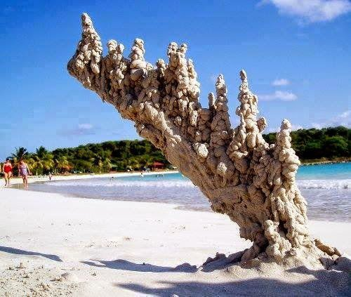

*Réponse publiée [sur Quora](https://fr.quora.com/Serait-il-possible-de-transformer-la-foudre-en-quelque-chose-d-autre-o%C3%B9-la-foudre-pourrait-%C3%AAtre-exploit%C3%A9e/answer/Dr-Goulu)*

on peut en faire de la [Fulgurite](w:), qui se vend beaucoup plus cher que les quelques dizaines d'euros d'électricité correspondant à un éclair.

[https://www.drgoulu.com/2007/09/...](/2007/09/09/lenergie-de-la-foudre/)

Et c'est presque aussi joli

