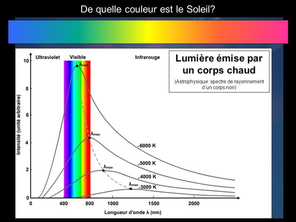

*Réponse publiée [sur Quora](https://fr.quora.com/Est-il-possible-de-bronzer-%C3%A0-la-flamme-d-une-bougie-Emmet-elle-des-UV/answer/Dr-Goulu)*

Non, une flamme n'est pas assez chaude pour émettre des UV.

Un objet chaud émet par [Rayonnement du corps noir](w:)en fonction de sa température ainsi :

On voit qu'en dessous de 3000K environ (2700°C) environ, il n'y a pas d'émission dans l'ultraviolet.

Une flamme de bougie a une température de 600°C à 1000°C. Elle produit des infrarouges, et un tout petit peu de lumière visible.
