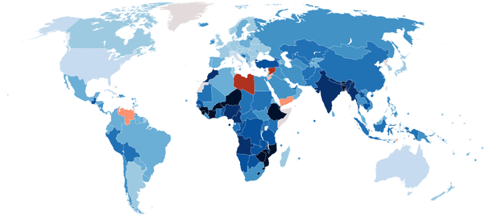

*Réponse publiée [sur Quora](https://fr.quora.com/LAfrique-refuse-t-elle-le-d%C3%A9veloppement-A-t-elle-vraiment-les-potentialit%C3%A9s-de-se-d%C3%A9velopper/answer/Dr-Goulu)*

L'Afrique est composée de 55 pays très différents, mais dans l'ensemble ils sont en plein boum économique et de développement.

Si vous consultez

[https://donnees.banquemondiale.o...](https://donnees.banquemondiale.org/indicator/NY.GDP.MKTP.KD.ZG)

Vous verrez 3 pays africains dans le top 10, et 8 qui ont des croissances économiques plus rapides que la Chine.

Et avec l'[Indice de développement humain](w:), c'est encore plus net : cette carte montre l'augmentation de l'IDH entre 2010 et 2019 :

On voit qu'à part la Libye hélas, toute l'Afrique a plus progressé que l'Europe, les USA ou l'Australie, et souvent plus que les pays asiatiques à l'exception de l'Inde, en plein boum elle aussi.

Amis africains, c'est enfin votre tour d'atteindre un bon niveau de vie. Ça prendra encore quelques dizaines d'années mais l'Afrique est le prochain eldorado. Les chinois ne se trompent pas en investissant massivement chez vous.
