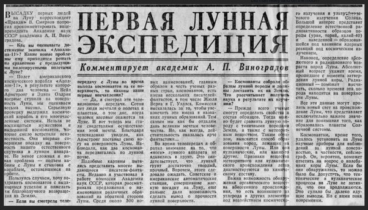

*Réponse publiée [sur Quora](https://fr.quora.com/Comment-puis-je-prouver-%C3%A0-un-conspirationniste-que-nous-sommes-all%C3%A9s-sur-la-lune/answer/Dr-Goulu)*

avec ça:

C'est l'article intitulé “Des habitants de la Terre sur la Lune” du 22 juillet 1969 dans la Pravda, organe officiel du parti communiste de l'URSS.

Même si ça n'est qu'en page 5, c'est très fair-play. Les russes étaient en course, ils avaient les moyens d'espionner toutes les communications avec la Lune, et même de les brouiller ce qu'ils n'ont pas fait.

Ils ont félicité les Américains et invité Armstrong a Moscou, où ils lui ont injecté du sérum de vérité pour savoir si il y avait vraiment été. Nan, je déconne : il a été reçu avec tous les honneurs, a pu visiter les centres spatiaux russes, rencontré ses homologues russes, donné des conférences

[https://www.anecdotes-spatiales....](https://www.anecdotes-spatiales.com/le-voyage-de-neil-armstrong-en-urss/)

Il y a évidemment une multitude d'autres informations et objets qui prouvent sans aucun doute que la NASA a posé sur la lune 12 astronautes et en a ramené sains et saufs 14, mais la reconnaissance par les "perdants" est une preuve que j'adore jeter à la face des complotistes.
