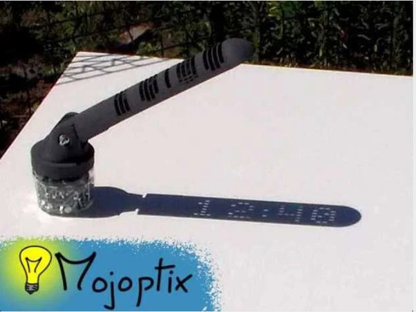

*Réponse publiée [sur Quora](https://fr.quora.com/Avec-une-bonne-imprimante-3D-et-pas-mal-de-calculs-serait-il-possible-de-concevoir-un-cadran-solaire-%C3%A0-affichage-num%C3%A9rique/answer/Dr-Goulu)*

un truc comme ça :

oui, ça m'a l'air possible :-)

Le modèle est là :

[https://www.thingiverse.com/thin...](https://web.archive.org/web/20210321222824/https://www.thingiverse.com/thing:1068443)

C'est fou ce qu'une recherche Google peut donner, vous devriez essayer …
