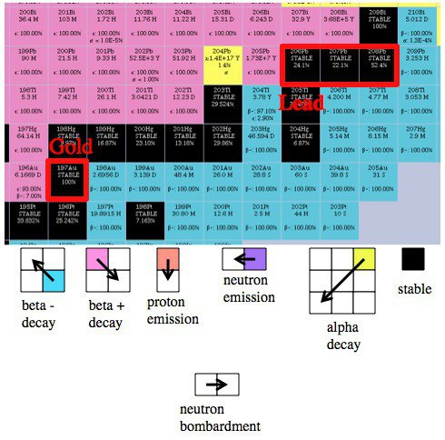

*Réponse publiée [sur Quora](https://fr.quora.com/Comment-pourrait-on-transformer-un-atome-de-mercure-en-atome-dor/answer/Dr-Goulu)*

Comme expliqué dans

[https://www.drgoulu.com/2013/03/...](/2013/03/15/comment-transformer-le-plomb-en-or/)

on peut bombarder le mercure avec des neutrons qui se font capturer et "décalent l'isotope d'une case à droite" jusqu'à obtenir un isotope radioactif, puis attendre sa désintégration, ce qui "décale l'isotope en diagonale" selon la règle ci-dessous :

On voit que le seul isotope de [mercure](w:Mercure_(chimie))stable "bien placé" pour former de l'Au197 stable est Hg196 (dont on ne voit que le bord noir à gauche de la figure…).

En le bombardant, il va devenir du Hg197, et au bout de 64 heures il y a 1 chance sur deux pour qu'il ait transformé un de ses protons en neutron en émettant un positon (radioactivité beta+) et devienne de l'Au 197.

Le problème est que Hg196 ne représente que 0.15% des atomes de mercure…

Mais bon, puisque votre question ne concerne qu'un seul atome, choisissez cet isotope, c'est plus simple :-)

Parce qu'avec les autres, le bombardement neutronique va les transformer en Hg203 ou 205 qui vont se transformer en Thalium 203 ou 205, pas en Or.

L'autre solution, c'est d'utiliser des neutrons rapides pour "shooter" des neutrons ou des protons du mercure au passage, ce qui décale les isotopes vers le bas ou la gauche.

Ca donne toutes sortes d'isotopes, dont de l'or radioactif, et ça a été fait en 1941 déjà :

[https://journals.aps.org/pr/abst...](https://web.archive.org/web/20210305005521/https://journals.aps.org/pr/abstract/10.1103/PhysRev.60.473)
