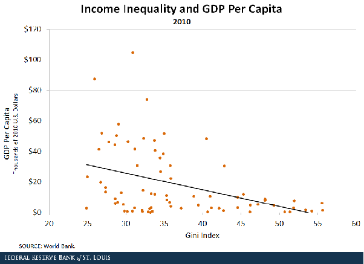

*Réponse publiée [sur Quora](https://fr.quora.com/Comment-sortir-de-ce-capitalisme-d%C3%A9vastateur-pour-la-plan%C3%A8te-et-ses-citoyens-qui-ne-fait-quaugmenter-les-in%C3%A9galit%C3%A9s/answer/Dr-Goulu)*

Etes vous sur de ce que vous dites ?

Parce que moi je vois que dans les dernières décennies les inégalités globales ont été réduites par la disparition du fossé entre les pays "développés" et "en développement".

Bizarrement, depuis que la Chine communiste a libéralisé son économie, 1 milliard d'humains se rapprochent à grande vitesse du niveau de vie occidental, et c'est le cas aussi de l'Inde (un autre milliard) et de bon nombre d'autres pays.

Il faut absolument voir cette conférence de Hans Rosling pour comprendre ce fantastique changement :

[https://www.ted.com/talks/hans_r...](https://web.archive.org/web/20210518115727/https://www.ted.com/talks/hans_rosling_the_best_stats_you_ve_ever_seen?language=fr)

Accessoirement, je viens de découvrir cette figure [ici](https://web.archive.org/web/20210518013559/https://www.stlouisfed.org/on-the-economy/2017/october/how-us-income-inequality-compare-worldwide) :

Elle montre qu'il existe une corrélation négative entre le revenu par habitant et le coefficient de Gini dans les pays : plus on est riches, plus on est égalitaire.

C'est probablement parce qu'alors on a les moyens d'avoir une politique sociale.

Et là se pose la bonne question : pourquoi, malgré des dépenses colossales dans le social, beaucoup d'états n'arrivent pas à réduire leur inégalité "interne" ?

Donc si vous avez sous la main un système miracle qui permettrait à 8 milliards d'humains de vivre 72 ans avec plus d'égalité qu'aujourd'hui, mais sans goulag ou lobotomie obligatoire, je suis preneur.
