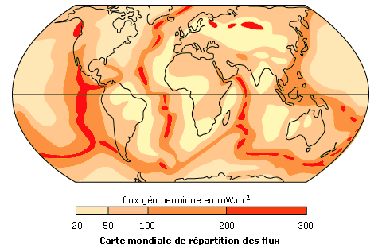

*Réponse publiée [sur Quora](https://fr.quora.com/En-quoi-la-G%C3%A9ologie-peut-elle-expliquer-le-r%C3%A9chauffement-climatique-Quest-ce-que-le-g%C3%A9ologue-peut-apporter-au-climatologue-dont-ce-dernier-na-pas-conscience/answer/Dr-Goulu)*

en pas grand chose.

Le flux de chaleur provenant de la terre est bien connu, il vaut environ 300 milliwatt par m2 sur les dorsales océaniques, mais 60 milliwatt par m2 en moyenne.

(source

[https://www.maxicours.com/se/cou...](https://www.maxicours.com/se/cours/gradient-et-flux-geothermiques/)

)

Le rayonnement solaire au sol est de 340 Watt par m2 en moyenne, soit 5600 fois plus.

[Constante solaire](w:Constante_solaire)

D'autre part, l'augmentation du forçage radiatif anthropique entre 1750 et 2011 est évaluée à 2,29 (1,13 à 3,33) Watt/m2 par le cinquième rapport du [GIEC](w:Groupe_d'experts_intergouvernemental_sur_l'évolution_du_climat), soit près de 4 fois la totalité du flux géothermique

On peut donc quasiment négliger le flux géothermique, qui n'a aucun effet sur le réchauffement climatique.

Par contre la géologie, et plus précisément le volcanisme provoque des périodes (courtes) de refroidissement par l'émission de particules et de SO2 dans l'atmosphère.

[Hiver volcanique](w:Hiver_volcanique)
