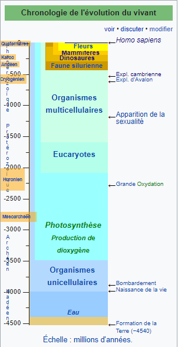

*Réponse publiée [sur Quora](https://fr.quora.com/Est-il-possible-quune-civilisation-d%C3%A9velopp%C3%A9e-ait-exist%C3%A9-avant-la-formation-de-la-Lune-et-quelle-ait-ensuite-%C3%A9t%C3%A9-d%C3%A9truite-lors-de-sa-formation/answer/Dr-Goulu)*

Non.

La Terre s'est formée il y a 4,543 milliards d'années et la [Lune](w:)il y a 4.51 milliards d'années environ, soit 30 millions d'années après, pratiquement le lendemain. On peut dire que le système solaire était toujours en formation, avec des impacts cataclysmiques "fréquents".

A cette époque la Terre était très chaude, recouverte d'un [Océan magmatique](w:)et n'avait pas encore d'océans : l'eau était emprisonnée dans le volume de la planète et sortait par volcanisme[[1]](#bWDBR) . Il n'y avait absolument pas les conditions nécessaires à la formation de la moindre bactérie.

Les plus anciennes traces de vie datent d'environ 4 milliards d'années, donc environ un demi milliard d'années après la formation de la Terre et de la Lune.

Ce petit tableau résume la [Chronologie de l'évolution du vivant](w:):

Notes de bas de page

[[1]](#cite-bWDBR)[Comment sont nés les océans ?](https://web.archive.org/web/20210503104913/http://www.linternaute.com/science/environnement/comment/06/oceans/oceans.shtml)
