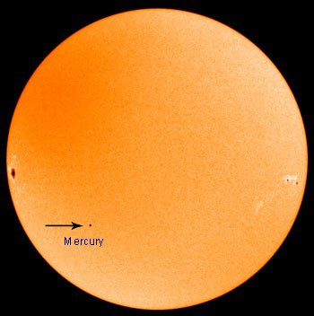
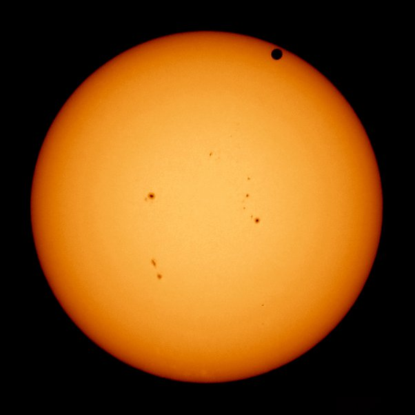

*Réponse publiée [sur Quora](https://fr.quora.com/Est-il-possible-que-Mercure-ou-V%C3%A9nus-passe-entre-la-Terre-et-le-Soleil-et-cr%C3%A9e-une-%C3%A9clipse-solaire/answer/Dr-Goulu)*

C'est non seulement possible mais fréquent.

Nous voyons Mercure passer devant le soleil 13 ou 14 fois par siècle. Le 8 novembre 2006, ca ressemblait à ça :

[Transit de Mercure](w:Transit_de_Mercure)

Pour Vénus les transits suivent une séquence qui se répète tous les 243 ans, avec des paires de transits espacés de 8 ans séparées par 121,5 puis 105,5 ans.

La dernière paire de transits à eu lieu en 2004 et 2012. Photo :

(Vénus est le disque noir en haut)

[Transit de Vénus](w:Transit_de_Vénus)

Comme vous le voyez, ces transits sont loin de pouvoir provoquer des éclipses. Les planètes sont beaucoup trop petites.

Pourtant des extraterrestres équipés d'appareils de mesure sensibles pourraient détecter la baisse de luminosité du soleil pendant ces transits, et en déduire l'existence de "nos" planètes.

C'est exactement ce que nous faisons pour détecter les leurs…
