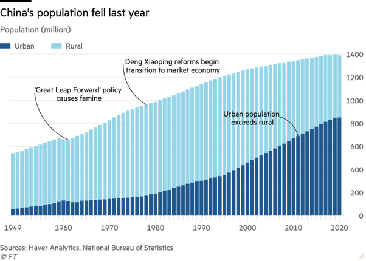

*Réponse publiée [sur Quora](https://fr.quora.com/Est-il-vrai-que-la-population-de-la-Chine-d%C3%A9clinerait-d%C3%A8s-cette-ann%C3%A9e-2021/answer/Dr-Goulu)*

Il semble qu'elle a un tout petit peu décru en 2020, pour la première fois depuis le "Grand Bond en Avant" de Mao qui avait causé une terrible famine au début des années 1960.

Mais comme on le voit sur le graphique ci-dessous, ça doit plutôt être un "accident" car la croissance de la population était encore assez régulière ces 10 dernières années :

[(source : Financial Times](https://web.archive.org/web/20211125195807/https://www.ft.com/content/008ea78a-8bc1-4954-b283-700608d3dc6c) )

On dirait l'effet d'un virus.. mais la Chine n'a pas annoncé autant de décès alors elle conteste ces chiffres et dit que sa population a augmenté en 2020[[1]](#nefDW)

On aura en début d'année prochaine les chiffres pour 2021, mais il faudra attendre quelques années pour savoir si le gouvernement chinois a réussi a relancer la natalité comme il le souhaite, ou pas.

Le maximum de population chinoise était attendu pour 2030 environ, ce sera peut-être 2025 déjà, ou même 2019 si le Covid a été sous-estimé …

[https://www.allnews.ch/content/p...](https://www.allnews.ch/content/points-de-vue/le-vieillissement-de-la-population-chinoise)

Notes de bas de page

[[1]](#cite-nefDW)[Update: China’s population grew in 2020, statistics authority says, contrary to FT report](https://www.globaltimes.cn/page/202104/1222404.shtml)
