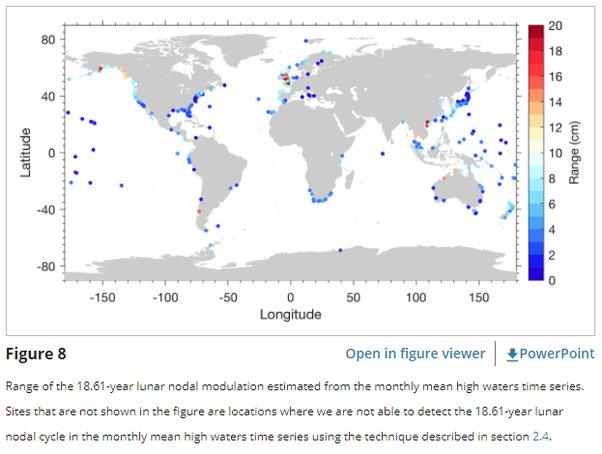

*Réponse publiée [sur Quora](https://fr.quora.com/Faut-il-vraiment-sinqui%C3%A9ter-de-loscillation-de-lorbite-de-la-Lune-annonc%C3%A9e-par-la-NASA/answer/Dr-Goulu)*

Alors ça c'est super intéressant.

Toutes les infos "grand public" en français à ce sujet comme

[Une "oscillation" de l'orbite de la Lune dans les années 2030 : des conséquences terribles sur Terre selon la Nasa](https://www.ladepeche.fr/2021/07/14/une-oscillation-de-lorbite-de-la-lune-dans-les-annees-2030-des-consequences-terribles-sur-terre-selon-la-nasa-9670649.php)

se réfèrent à ce site en anglais

[A 'wobble' in the moon's orbit could result in record flooding in the 2030s, new study finds](https://www.livescience.com/high-tide-flooding-climate-change-2030)

qui se réfère à cet article scientifique

[Rapid increases and extreme months in projections of United States high-tide flooding - Nature Climate Change](https://www.nature.com/articles/s41558-021-01077-8)

**qui ne mentionne pas une seule fois le mot "Moon" ni le mot "orbit" !**

La période de 18.6 ans mentionnée dans les articles "grand public" correspond en fait à la précession des "nœuds" de l'[Orbite de la Lune](w:) bien connue depuis des siècles, et qui produirait, selon le type qui a eu l'idée bizarre d'associer les deux choses, une augmentation des marées **aux Etats-Unis** dans les années 2030.

On a donc quelque part un journaleux inculte qui associe deux infos totalement indépendantes (jusqu'à preuve du contraire…) à propos de son petit pays et qui en fait un buzz planétaire parce que personne n'a l'esprit critique de cliquer 2 liens pour vérifier.

A noter que l'article scientifique concerne à 100% le réchauffement climatique. Je me demande si cette intox n'est pas une n-ième tentative d'un climatosceptique de dévier l'attention vers un phénomène astronomique…

à suivre…

Accessoirement, méfiez vous des "annonces par la NASA". C'est un peu comme les citations d'Einstein, ça fait sérieux. Mais la NASA s'occupe de missions spatiales. [Un seul des 7 auteurs de l'article](https://www.nature.com/articles/s41558-021-01077-8#author-information) travaille pour la NASA (le JPL en fait) . La [NASA a seulement cofinancé](https://www.nature.com/articles/s41558-021-01077-8#Ack1) l'étude, notamment en salariant le chercheur en question

edit : en fait, une des 47 références de l'article scientifique est cette autre étude

[Tide Gauge Records Show That the 18.61‐Year Nodal Tidal Cycle Can Change High Water Levels by up to 30 cm](https://web.archive.org/web/20210716013954/https://agupubs.onlinelibrary.wiley.com/doi/10.1029/2018JC014695)

qui montre que la précession des nœuds peut entraîner des variations de l'amplitude des marées jusqu'à 30 cm à certains endroits.. D'après la carte qu'ils fournissent, il n'y a pas beaucoup de ces endroits …

