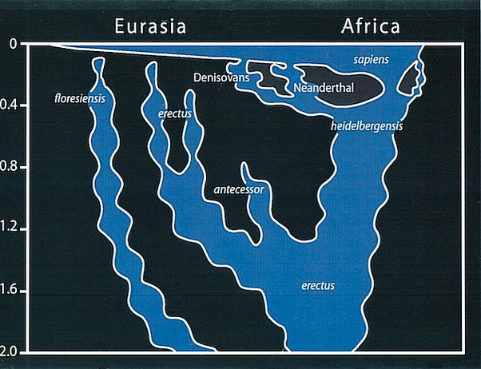

---

title: Le Pr Raoult, dans sa dernière vidéo Youtube, affirme que la plupart d'entre nous, les humains, serions un mélange de Néandertal, de Denisova, de Sapiens et Sapiens Sapiens et non pas seulement des Sapiens Sapiens. Qu'en pensez-vous ?
slug: le-pr-raoult-dans-sa-derniere-video-youtube-affirme-que-la-plupart-d-entre-nous-les-humains-serions-un-melange-de-neandertal-de-denisova-de-sapiens-et-sapiens-sapiens-et-non-pas-seulement-des-sapiens-sapiens-qu-en-pensez-vous
date: '2021-06-20'
draft: true
categories:
- Quora
tags: []
coverImage: ./images/qimg-e233f07fbb2bd59db1e2ee00f80a1b6c.jpg
---

*Réponse publiée [sur Quora](https://fr.quora.com/Le-Pr-Raoult-dans-sa-derni%C3%A8re-vid%C3%A9o-Youtube-affirme-que-la-plupart-d-entre-nous-les-humains-serions-un-m%C3%A9lange-de-N%C3%A9andertal-de-Denisova-de-Sapiens-et-Sapiens-Sapiens-et-non-pas/answer/Dr-Goulu)*

Je n'en pense rien, l'[Hybridation entre les humains archaïques et modernes](w:) est un fait désormais établi.

C'était cependant assez marginal, nous sommes surtout des Sapiens, avec un peu de Néandertal surtout en Europe et un peu de Denisova surtout en Asie.

Néandertal et Denisova étaient des cousins proches, tout aussi humains que nos ancêtres à cette époque

