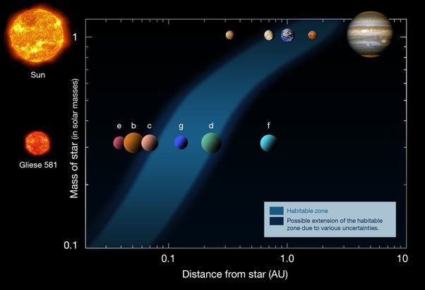

*Réponse publiée [sur Quora](https://fr.quora.com/Le-site-web-TRT-donne-le-nom-des-24-plan%C3%A8tes-habitables-ne-connaissant-que-Jupiter-mars-mercure-neptune-pluton-saturne-terre-uranus-venus-syst%C3%A8me-solaire-ont-elles-un-nom/answer/Dr-Goulu)*

(edit : j'ai ajouté le lien à la question, mais l'article ne donne pas le nom des 24 planètes retenues…)

Les exoplanètes sont "baptisées" en suivant la convention de l'Union Astronomique Internationale [décrite ici](w:Exoplanète).

Pour les systèmes "simples", avec une seule étoile, on donne aux planètes le nom de l'étoile suivi d'une lettre minuscule dans l'ordre où on a découvert les planètes, en commençant par "b", "a" étant réservé pour l'étoile

Par exemple

[Gliese 581](w:Gliese_581)

est un système comprenant les planètes Gliese 581 e, Gliese 581 b, [Gliese 581 c](w:), [Gliese 581 g](w:), [Gliese 581 d](w:), Gliese 581 f dans l'ordre à partir de l'étoile.

Les trois que j'ai mis en lien (c, g et d) sont considérées comme "habitables" parce qu'elles sont dans la [zone habitable](w:) de leur étoile, mais rien ne dit qu'elles le soient. Comme on le voit dans le comparatif ci-dessous, dans le Système Solaire, Mars est en zone habitable et Vénus à la limite, alors qu'elles sont invivables :

Actuellement on utilise le

[Earth Similarity Index](w:en:Earth_Similarity_Index)

pour qualifier plus finement l'habitabilité par rapport à la Terre. Sur cette échelle, la Terre vaut 1.0, Mars 0.70 et on connaît 28 exoplanètes classées entre deux.

La plus similaire dont l'existence ne fait plus de doute est

[TRAPPIST-1 e](w:TRAPPIST-1_e)
