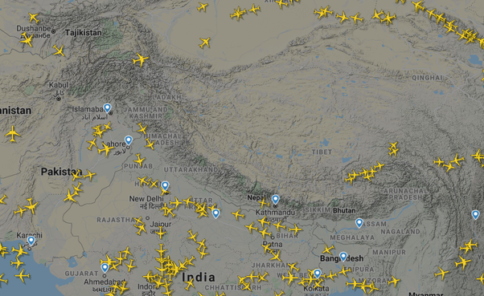
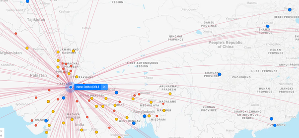

*Réponse publiée [sur Quora](https://fr.quora.com/Les-avions-de-ligne-survolent-ils-l-Himalaya/answer/Dr-Goulu)*

En ce moment le trafic est plutôt calme sur [Flightradar24](https://web.archive.org/web/20210427024321/https://www.flightradar24.com/) (décalage horaire…)

mais en ne traçant que les vols depuis New Dehli sur [FlightConnections](https://www.flightconnections.com/), on voit que pas mal doivent franchir l'Himalaya, notamment pour aller vers Beijing :

