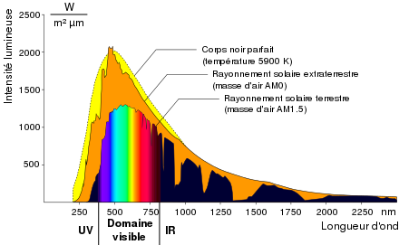
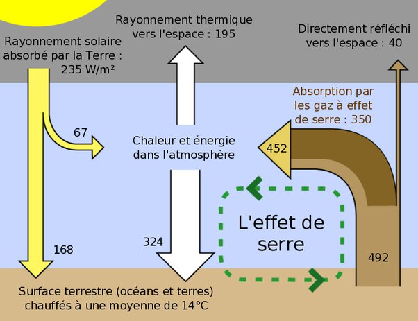
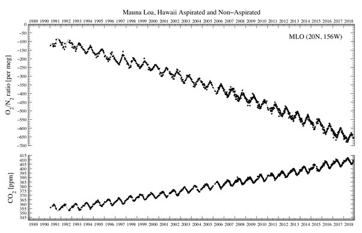

---

title: Pourquoi la chaleur dans l'atmosphère est-elle causée par le CO2 (0,04 % dans l'atmosphère) qui absorbe la lumière infrarouge ? Si l'oxygène (21% de l'atmosphère) absorbe la lumière ultraviolette et crée de la chaleur?
slug: pourquoi-la-chaleur-dans-l-atmosphere-est-elle-causee-par-le-co2-0-04-dans-l-atmosphere-qui-absorbe-la-lumiere-infrarouge-si-l-oxygene-21-de-l-atmosphere-absorbe-la-lumiere-ultraviolette-et-cree-de-la-chaleur
date: '2021-07-06'
draft: true
categories:
- Pourquoi
tags: []
coverImage: ./images/qimg-8ddfd5d552ef1365f3f9b307dfa2fb1a.png
---

*Réponse publiée [sur Quora](https://fr.quora.com/Pourquoi-la-chaleur-dans-l-atmosph%C3%A8re-est-elle-caus%C3%A9e-par-le-CO2-004-dans-l-atmosph%C3%A8re-qui-absorbe-la-lumi%C3%A8re-infrarouge-Si-l-oxyg%C3%A8ne-21-de-l-atmosph%C3%A8re-absorbe-la-lumi%C3%A8re/answer/Dr-Goulu)*

Encore du grand n'importe quoi.

D'abord, le Soleil rayonne peu d'ultraviolets et beaucoup d'infrarouges

Ensuite, l'atmosphère intercepte en effet 67 W/m2 de lumière solaire, mais surtout 452 W/m2 d'infrarouges émis par la surface. C'est ça qu'on appelle [Effet de serre :](w:Effet_de_serre)

Cet [Effet de serre](w:)est causé à 60% par la vapeur d'eau, à 26% par le CO2, à 8% par l'ozone (de l'oxygène si vous voulez…) et 6% par les autres gaz à effet de serre, principalement le méthane.

Enfin, la quantité d'oxygène dans l'atmosphère diminue légèrement au fur et à mesure que du CO2 est formé

