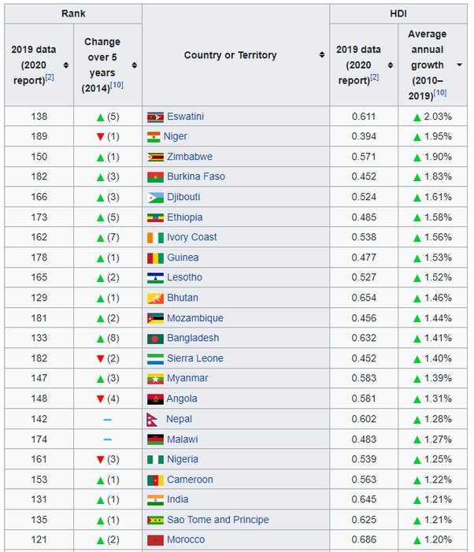

*Réponse publiée [sur Quora](https://fr.quora.com/Que-doivent-faire-les-pays-francophones-dAfrique-ayant-des-liens-%C3%A9troits-avec-la-France-pour-se-d%C3%A9velopper-ce-quils-ne-font-pas/answer/Dr-Goulu)*

(je ne suis pas français, je suis suisse et j'aime les faits ;-) )

Quand vous dites "ce qu'ils ne font pas" , vous voulez dire "se développer" ?

Alors là je ne suis pas d'accord. Beaucoup de pays africains sont en plein boum.

Si vous regardez

[https://donnees.banquemondiale.o...](https://donnees.banquemondiale.org/indicator/NY.GDP.PCAP.KD.ZG?most_recent_value_desc=true)

vous verrez que l'Erythrée, le Rwanda, Djibouti et l'Ethiopie sont dans les top 10 de la croissance économique, devant la Chine qui est 10ème. Un peu plus bas dans le classement vous avez le Ghana , le Bénin et la Côte d'Ivoire qui ont des croissances de plus de 3.5%, à faire pâlir d'envie la France (1.4%)

Mais vous me direz qu'il n'y a pas que le pognon dans la vie, et vous aurez raison. Alors triez la

[List of countries by Human Development Index](w:en:List_of_countries_by_Human_Development_Index)

par croissance de l'[Indice de développement humain](w:), qui intègre aussi l'éducation et l'espérance de vie. Vous allez obtenir ça :

Les 9 pays du monde qui ont la croissance de l'IDH la plus rapide sont africains, et plusieurs sont francophones. OK ils sont en queue de classement pour l'instant mais ça ne va pas durer. L'Afrique sera l'eldorado du 21ème siècle.

Ce que peuvent faire les pays africains et leurs habitants, c'est:

- arrêter de se sous-estimer. Il n'y a plus de Tiers-Monde, le fossé entre pays "en développement" et "développés" s'est comblé. et c'est désormais un continuum. Si vous ne me croyez pas , voyez cette conférence à tout prix :

[https://www.ted.com/talks/hans_r...](https://www.ted.com/talks/hans_rosling_the_best_stats_you_ve_ever_seen?language=fr)

- arrêtez de compter sur la France. Elle a ses propres problèmes, la pauvre. Comme disent les banquiers de mon pays "l'argent n'a pas d'odeur" : prenez-le là où il est. La Chine est un très gros investisseur en Afrique, et tant pis pour les compagnies européennes et américaines qui garderont des mauvaises habitudes néocoloniales.
- gardez vos forces. A moins que vous ne puissiez venir étudier légalement en Europe pour retourner chez vous après, n'émigrez pas. Vous avez un meilleur avenir en développant votre pays, en participant à son économie et sa politique qu'en venant ici travailler au noir (…) ou pire. Sérieusement, si j'avais 30 ans de moins je chercherais un job ou je créerais une entreprise en Afrique aujourd'hui. (et si vous avez un poste de prof ouvert dans un endroit sympa pour ma pré-retraite, ça m''intéresse…)
