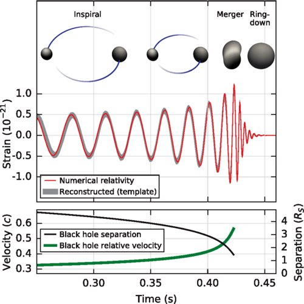

*Réponse publiée [sur Quora](https://fr.quora.com/Que-se-passerait-il-si-deux-trous-noirs-supermassifs-entrent-en-collision-%C3%A0-la-vitesse-de-la-lumi%C3%A8re/answer/Dr-Goulu)*

En fait les collisions de trous noirs ont lieu à la vitesse de la lumière, ou presque.

Il faut penser à la [Vitesse de libération](w:)à l'envers : si on doit tirer un projectile à 11.2 km/s pour qu'il échappe à la gravité terrestre, un objet qui arriverait tranquille peinard dans le voisinage terrestre sera accéléré (Albert pardonne moi…) et tombera au sol à… 11.2 km/s s'il n'y avait pas d atmosphère pour le freiner.

Sachant que l'horizon des événements d'un trou noir correspond à une vitesse de libération égale à celle de la lumière, vous pouvez en déduire que tout objet qui tombe sur un trou noir entre dans l'horizon à une vitesse proche de c.

En pratique les collisions sont rarement frontales, les objets sont plutôt en orbite de plus en plus rapprochée jusqu'à fusionner plutôt tangentielle ment, et là les mesures d'ondes gravitationnelles montrent qu'ils sont accélérés de 30% à 60% de c environ en moins de 0.2 seconde !

[https://astronomy.stackexchange....](https://web.archive.org/web/20211019173516/https://astronomy.stackexchange.com/questions/26811/what-is-the-actual-black-hole-merger-speed)
