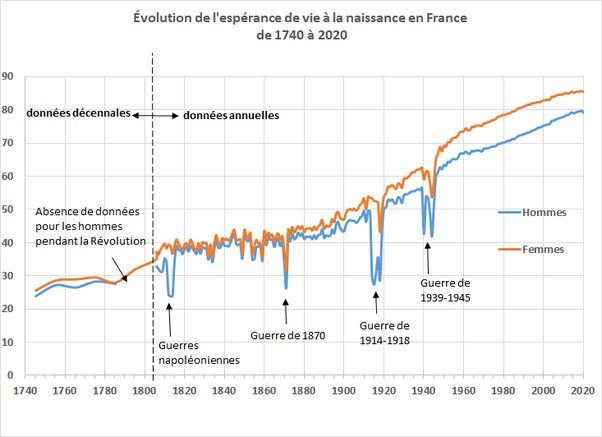

*Réponse publiée [sur Quora](https://fr.quora.com/Quel-%C3%A2ge-avaient-g%C3%A9n%C3%A9ralement-les-premiers-humains/answer/Dr-Goulu)*

Il n'y a pas eu de premiers humains[[1]](#kYzES) .

Nos cousins les plus proches les bonobos, chimpanzés, gorilles et orang-outans ont une espérance de vie d'environ 40 ans et vivent jusqu'à 60 ans en captivité, donc quand on s'occupe bien d'eux, qu'on les nourrit etc. On peut penser que c'était le cas aussi pour les vieux humains, du moins tant qu'ils pouvaient contribuer aux activités de la collectivité.

Les courbes de survie historiques (en France!) montrent qu'avant l'hygiène, la médecine et les vaccins, la moitié des humains mourrait avant l'âge de 8 ans.

avant 1800, l'espérance de vie des français était inférieure à celle des bonobos:

source : [L’espérance de vie en France](https://web.archive.org/web/20211203000901/https://www.ined.fr/fr/tout-savoir-population/graphiques-cartes/graphiques-interpretes/esperance-vie-france/) , INED

Notes de bas de page

[[1]](#cite-kYzES)[https://www.youtube.com/watch?v=...](https://www.youtube.com/watch?v=xdWLhXi24Mo)
