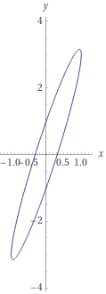

*Réponse publiée [sur Quora](https://fr.quora.com/Quel-est-le-graphe-de-x-2-y-3x-2-21/answer/Dr-Goulu)*

solution en deux copier/coller:

1. aller

[https://www.wolframalpha.com/inp...](https://web.archive.org/web/20211015/https://www.wolframalpha.com/input/?i=plot+x^2++(y-3√x^2)+^2=1)

2. retour

