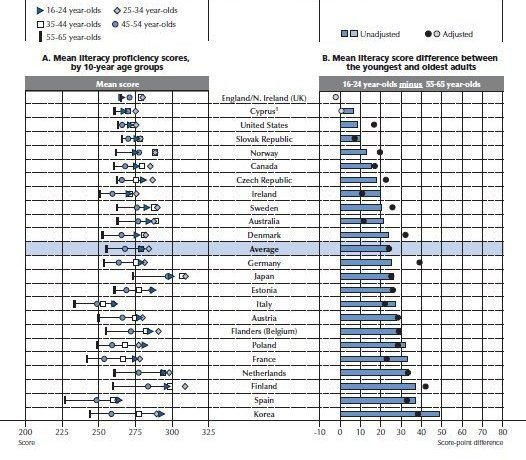

*Réponse publiée [sur Quora](https://fr.quora.com/Quelle-est-la-cons%C3%A9quence-de-la-baisse-du-niveau-des-%C3%A9l%C3%A8ves/answer/Dr-Goulu)*

Notre monde a atteint un stade critique. Les enfants n'écoutent plus leurs parents. La fin du monde ne peut pas être très loin.

Ce verdict très clair est écrit sur un papyrus égyptien datant de 4000 ans…

Et sur une poterie babylonienne de 3000 ans :

> Cette jeunesse est pourrie depuis le fond du cœur. Les jeunes gens sont malfaisants et paresseux. Ils ne seront jamais comme la jeunesse d'autrefois. Ceux d'aujourd'hui ne seront pas capables de maintenir notre culture.

Bon, sur la dernière phrase l'auteur n'avait pas tort : Babylone a disparu, et sa région est actuellement un peu dans le caca…

Plus récemment et plus près :

> Tout serait simple si le baccalauréat remplissait encore sa fonction. Mais, submergé sous le nombre des candidats qui s’est accru prodigieusement, le baccalauréat a vu son niveau baisser d’une façon constante, au point qu’il ne suffit pas actuellement à qualifier pour l’enseignement supérieur.

Ca ça date de 1947, quand 3% des français avaient le bac…

Bref, ça fait 4000 ans que le niveau scolaire baisse[[1]](#NJqFB) …

Là où ça devient intéressant, c'est quand une étude comme [PIAAC](https://web.archive.org/web/20210303211333/http://www.oecd.org/skills/piaac/)compare les scores par classes d'âge et qu'on s'aperçoit que dans tous les pays de l'OCDE sauf l'Angleterre (!!!), les jeunes (16–24 ans, triangles bleus dans la première colonne du graphique ci-dessous) font mieux que les 55–65 ans :

Bon ok, dans certains pays dont la France ils font moins bien que les 25–34 ans (losange gris), mais c'est peut-être parce que les 25–34 ans ont fait des études supérieures…

En fait il n'y a que l'Angleterre, Chypre, les USA, l'Australie, le Canada (tir groupé des anglo-saxons…) le Japon et quelques pays du nord de l'Europe (Norvège, Irlande, Suède, Finlande) où les 16–24 ans sont moins lettrés que les 35–44 ans.

Bref, une fois que vous aurez démontré une "baisse du niveau des élèves" statistiquement significative, je vous en dirai les conséquences.

Notes de bas de page

[[1]](#cite-NJqFB)[Idée reçue (1) : « le niveau baisse »](https://blog.francetvinfo.fr/l-instit-humeurs/2013/10/27/idee-recue-1-le-niveau-baisse.html)
